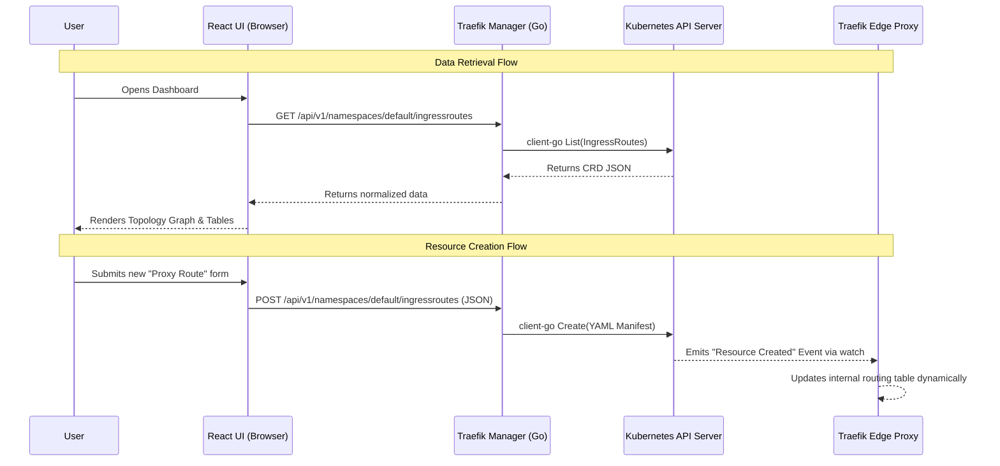
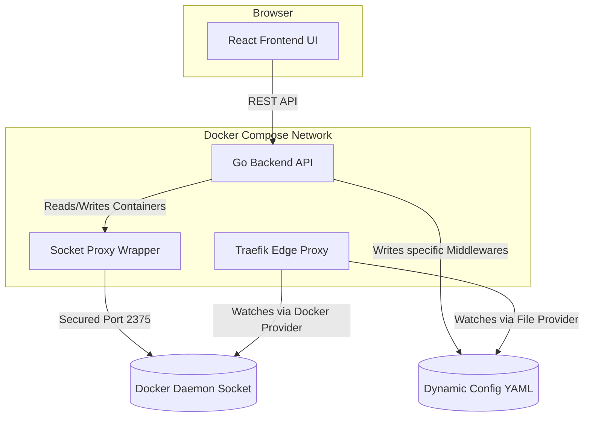

# Architecture & Operations

Traefik Manager is a stateless GUI application designed to abstract away the complexity of managing Traefik proxy configurations. 

This document explains the core philosophy and architecture of the project.

---

## 1. The Core Philosophy (Statelessness)

The most important concept to understand about Traefik Manager is that **it does not have its own database.** 

Instead of storing routing configurations in a SQL database and trying to "sync" them to your cluster, Traefik Manager reads and writes directly to the source of truth: **The Orchestrator's API** (Kubernetes or Docker).

* **When you open the UI:** The Go backend queries the Kubernetes API or Docker Daemon to see what routes currently exist, and sends that live data to the React frontend.
* **When you create a Route:** The Go backend translates your UI form into a raw Kubernetes YAML manifest (or Docker label format) and submits it directly to the orchestrator.

This guarantees that the Traefik Manager dashboard is always 100% in sync with reality.

---

## 2. Kubernetes Architecture (Primary)

In a Kubernetes environment, Traefik routes traffic by endlessly watching the Kubernetes API for Custom Resource Definitions (CRDs) like `IngressRoute` and `HTTPRoute`.

Traefik Manager simply acts as a visual interface to manage those exact same CRDs.

### The Kubernetes Setup
1. **Service Account:** Traefik Manager is deployed inside the cluster with a dedicated RBAC `ServiceAccount` granting it permission to Read and Write specific resources (like `Gateway`, `TraefikService`, `Middleware`, etc.).
2. **client-go:** The Go backend uses the official Kubernetes Go SDK (`client-go`) to authenticate and communicate with the API server.

---

## 3. Docker Compose Architecture (Secondary)

If you are not using Kubernetes, Traefik Manager allows you to manage traditional Docker containers by communicating with the Docker Daemon socket.

Rather than creating YAML CRDs, Traefik Manager translates your UI interactions into **Dynamic Configuration Files** or **Docker Container Labels**.

### The Docker Setup
1. **Socket Proxy:** For security, we never mount the raw `/var/run/docker.sock` directly into the Go backend. We use a proxy container (`tecnativa/docker-socket-proxy`) to expose the socket via TCP, ensuring Traefik Manager only has the permissions it absolutely needs.
2. **Dual Providers:** Traefik is configured to watch *both* the Docker Daemon (for auto-discovered container routes) and a shared `dynamic_conf.yaml` volume (for advanced elements like TLS certs resolving that don't map cleanly to labels). Traefik Manager handles writing to both simultaneously.
