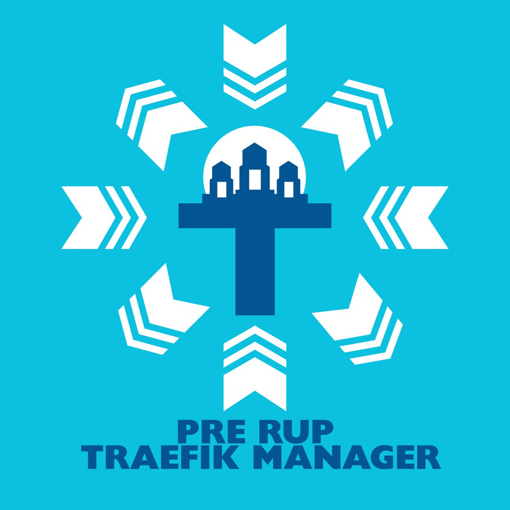

<div align="center">
  
</div>

# Pre Rup Traefik Manager

A web GUI for managing Traefik Proxy running in a Kubernetes cluster without writing complex YAML manifests.

## Architecture

```
Admin UI (React)  →  Go REST API  →  client-go  →  Kubernetes API  →  Traefik Ingress Controller
```

See [`ARCHITECTURE.md`](ARCHITECTURE.md) for a complete visual breakdown and explanation of how the UI, backend API, and infrastructure orchestrators communicate.

## Quick Start (Kubernetes)

### Prerequisites
- A working Kubernetes cluster (k3s, minikube, EKS, etc.)
- Traefik installed as an Ingress Controller (with CRDs available)

### Deployment

Traefik Manager is designed to run inside your cluster and interact directly with the Kubernetes API using a dedicated ServiceAccount. The recommended installation method is using Helm.

1. **Deploy via Helm:**
   ```bash
   helm upgrade --install traefik-manager ./charts/traefik-manager \
     --namespace traefik-manager \
     --create-namespace \
     --set service.type=ClusterIP \
     --set service.port=8080
   ```

2. **Access the UI:**
   ```bash
   kubectl port-forward svc/traefik-manager -n traefik-manager 8080:8080
   ```
   Open `http://localhost:8080` in your browser.

## Roadmap

- **Phase 1 (MVP):** Read/Write `IngressRoute` CRDs, Namespace and Service auto-discovery. (Completed)
- **Phase 2:** Manage Traefik `Middleware` CRDs (Basic Auth, UI Forms). (Completed)
- **Phase 3:** Cluster Packaging & RBAC. (Completed)
- **Phase 4:** Attach Middlewares to Routes, Resource Edit capabilities. (Completed)
- **Phase 5:** TLS Options and Stories Management. (Completed)
- **Phase 6:** Custom Helm chart packaging. (Completed)
- **Phase 7 (Gateway API):** Support for Kubernetes Gateway API (HTTPRoute, Gateway, etc.). (Completed)
- **Phase 8 (Observability):** Integrated UI for configuring OpenTelemetry, Datadog, Prometheus exporters.
- **Phase 9 (Traffic Delivery):** Visual traffic splitting (Canary, Blue/Green, Mirroring using TraefikService).
- **Phase 10 (Extensibility):** WASM Plugin management and deployment UI.
- **Phase 11 (Multi-Environment):** Support for non-Kubernetes backends (Docker Swarm, Amazon ECS, Nomad) via adapter interfaces.
